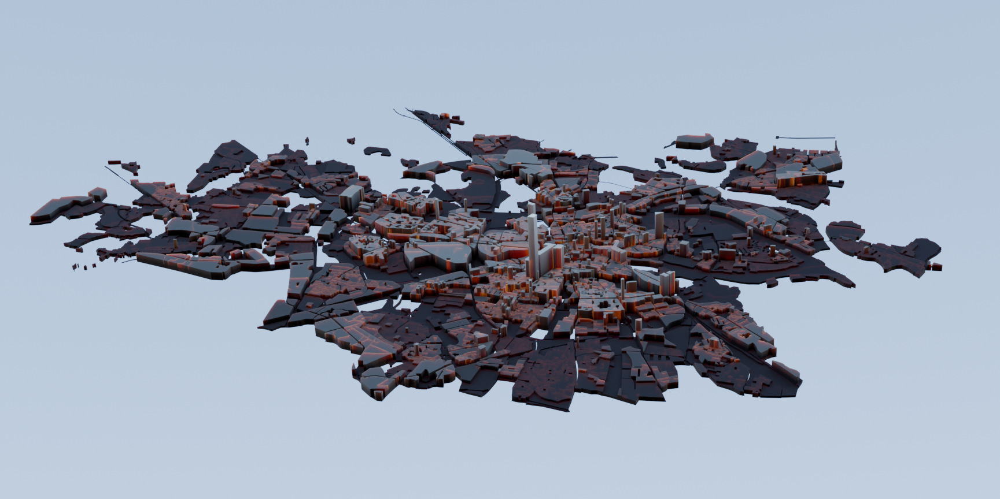
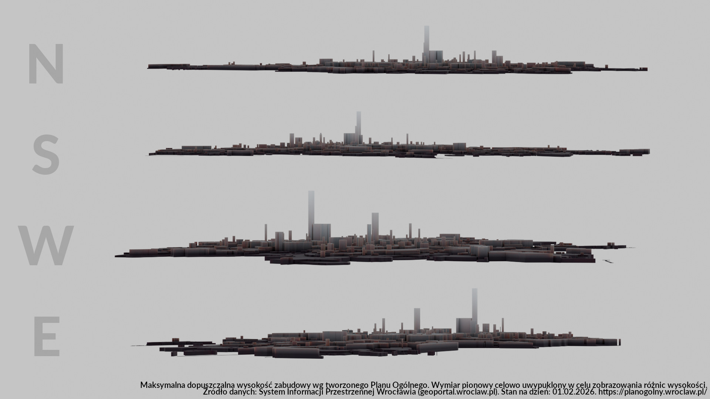
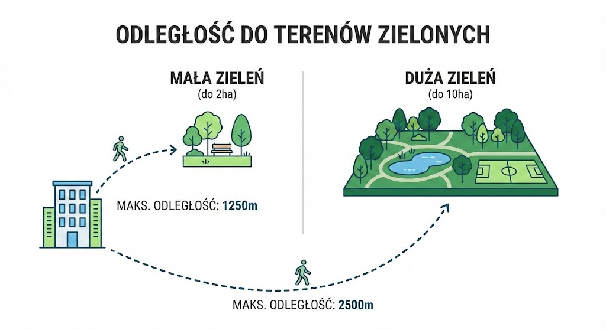
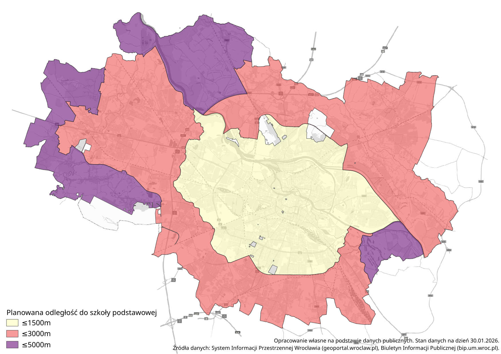
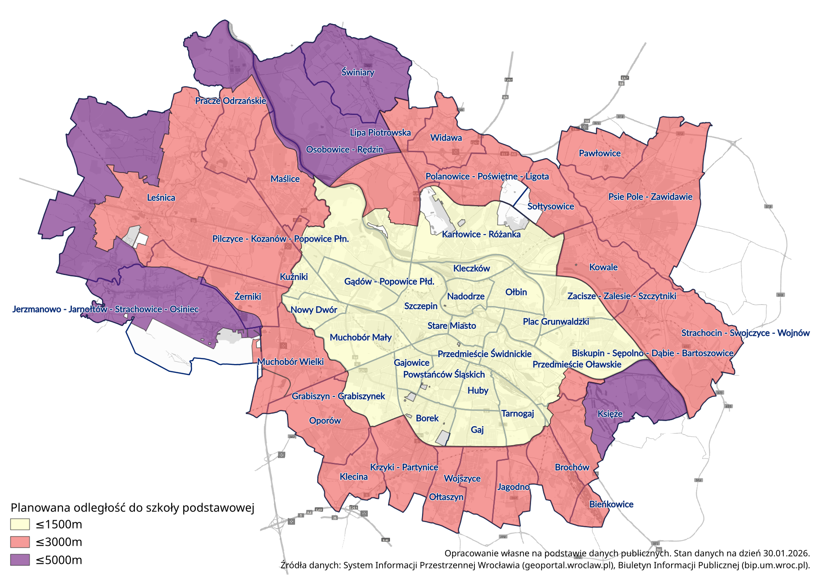

# Aktualny Plan

!!! notice "Aktualność danych"
    Dane przedstawione na tej stronie pochodzą z oficjalnych źródeł miejskich na dzień **30 stycznia 2026 roku**.

    Plan jest jeszcze w trakcie opracowywania i może ulec zmianom.

## Profil wysokościowy

Plan Ogólny - tak jak wcześniej Miejscowy Plan Zagospodarowania Przestrzennego - określa maksymalną wysokość zabudowy dla poszczególnych obszarów miasta.

Jeśli plan się utrzyma, a ograniczenia zostaną wykorzystane w pełni, to panorama Wrocławia może wyglądać tak:

## Odległość do zielenii

Plan Ogólny ustala maksymalne odległości do terenów zielonych:
- teren zielony o rozmiarze do 2ha w odległości do 1250m,
- teren zielony o rozmiarze do 10ha a w odległości 2500m.

Ustalenia odnośnie zieleni są jednolite dla całego miasta.

## Odległość do szkoły

Plan Ogólny precyzuje planowaną odległość do najbliższej szkoły podstawowej dla nowych osiedli mieszkaniowych. Odległośc liczona jest jako droga piesza, nie w linii prostej.

Obecnie zakłada się, że odległość do szkoły będzie wynosiła od 1500m w centrum do 5000m na obrzeżach, w oparciu o 3 strefy:

**Osiedla z odległością do szkoły mniejszą niż 1500m**: 
Biskupin-Sępolno-Dąbie-Bartoszowice, Borek, Gaj
Gajowice, Grabiszyn-Grabiszynek, Gądów-Popowice Płd.,
Huby, Karłowice-Różanka,  Kleczków, Kuźniki,
Muchobór Mały, Nadodrze, Nowy Dwór,
Ołbin, Pilczyce-Kozanów-Popowice Płn., Plac Grunwaldzki, 
Powstańców Śląskich, Przedmieście Oławskie, Przedmieście Świdnickie,
Stare Miasto, Szczepin, Tarnogaj, Zacisze-Zalesie-Szczytniki.

**Osiedla z odległością do szkoły między 1500m a 3000m**:
Bieńkowice, Brochów, Jagodno, Klecina, Kowale, Krzyki-Partynice,
Leśnica, Lipa Piotrowska, Maślice, Muchobór Wielki, Oporów,
Osobowice-Rędzin, Ołtaszyn, Pawłowice, Polanowice-Poświętne-Ligota,
Pracze Odrzańskie, Psie Pole-Zawidawie, Sołtysowice, Strachocin-Swojczyce-Wojnów,
Widawa, Wojszyce, Żerniki.

**Osiedla z odległością do szkoły między 3000m a 5000m**:
Jerzmanowo-Jarnołtów-Strachowice-Osiniec. Księże, 
Leśnica (częśc północno-zachodnia), Osobowice-Rędzin (część północna), 
Świniary. 

## Minimalny udział powierzchni biologicznie czynnej

Plan Ogólny określa minimalny udział powierzchni biologicznie czynnej (PBC) dla poszczególnych stref. Jest to kluczowy parametr dla nowych inwestycji.

Współczynnik ten nakazuje inwestorom, jaki procent powierzchni działki musi pozostać niezabudowany i nieutwardzony (np. trawniki, ogrody, stawy). Celem jest zachowanie retencji wody i bioróżnorodności w mieście.

Poniższa tabela przedstawia średni ważony wymóg PBC lub inaczej procentowy udział PBC w powierzchni całego osiedla:

| Osiedle | Udział PBC w powierzchni osiedla | Powierzchnia osiedla |
| :--- | :---: | :---: |
| Świniary | 70,5% | 9,14 km² |
| Osobowice - Rędzin | 66,3% | 18,65 km² |
| Księże | 63,6% | 10,61 km² |
| Strachocin - Swojczyce - Wojnów | 59,0% | 12,49 km² |
| Pracze Odrzańskie | 58,5% | 10,02 km² |
| Leśnica | 52,8% | 41,00 km² |
| Pilczyce - Kozanów - Popowice Płn. | 51,4% | 8,53 km² |
| Pawłowice | 50,7% | 4,44 km² |
| Sołtysowice | 49,5% | 4,55 km² |
| Zacisze - Zalesie - Szczytniki | 49,3% | 3,67 km² |
| Maślice | 47,4% | 6,61 km² |
| Psie Pole - Zawidawie | 47,1% | 16,45 km² |
| Przedmieście Oławskie | 45,5% | 5,97 km² |
| Biskupin - Sępolno - Dąbie - Bartoszowice | 44,6% | 5,90 km² |
| Ołbin | 42,8% | 2,61 km² |
| Wojszyce | 41,9% | 3,27 km² |
| Nowy Dwór | 40,5% | 1,91 km² |
| Kowale | 39,9% | 6,43 km² |
| Kleczków | 39,4% | 1,88 km² |
| Grabiszyn - Grabiszynek | 39,2% | 4,10 km² |
| Kuźniki | 38,9% | 1,46 km² |
| Gaj | 38,7% | 2,59 km² |
| Krzyki - Partynice | 38,6% | 5,25 km² |
| Stare Miasto | 38,2% | 2,00 km² |
| Ołtaszyn | 38,1% | 3,37 km² |
| Widawa | 37,9% | 4,10 km² |
| Polanowice - Poświętne - Ligota | 37,8% | 5,65 km² |
| Brochów | 37,3% | 3,74 km² |
| Muchobór Mały | 37,0% | 4,97 km² |
| Żerniki | 37,0% | 3,91 km² |
| Nadodrze | 34,6% | 1,99 km² |
| Tarnogaj | 34,2% | 2,95 km² |
| Gajowice | 33,7% | 1,71 km² |
| Muchobór Wielki | 33,7% | 6,88 km² |
| Klecina | 33,4% | 3,77 km² |
| Jagodno | 32,6% | 3,43 km² |
| Huby | 32,5% | 2,07 km² |
| Plac Grunwaldzki | 32,4% | 1,45 km² |
| Oporów | 32,1% | 6,46 km² |
| Szczepin | 31,6% | 4,40 km² |
| Gądów - Popowice Płd. | 30,9% | 3,13 km² |
| Karłowice - Różanka | 30,5% | 11,10 km² |
| Borek | 30,2% | 2,76 km² |
| Lipa Piotrowska | 30,1% | 2,89 km² |
| Powstańców Śląskich | 30,1% | 2,37 km² |
| Bieńkowice | 29,8% | 1,43 km² |
| Przedmieście Świdnickie | 26,8% | 1,51 km² |
| Jerzmanowo - Jarnołtów - Strachowice - Osiniec | 26,5% | 17,23 km² |

!!! info "Jak interpretować te wyniki?"
    Należy pamiętać, że powyższy wskaźnik jest średnią dla całego obszaru osiedla i uwzględnia również tereny, na których zieleń nie występuje, np. drogi, tory kolejowe, place utwardzone.
    
    * **Wysokie wyniki** (np. Świniary, Osobowice) wynikają często z dużej ilości terenów chronionych, lasów, pól irygacyjnych, które w Planie Ogólnym mają bardzo wysokie wymogi ochrony.
    * **Niskie wyniki** (np. Bieńkowice, Jerzmanowo) mogą wynikać z obecności dużej infrastruktury komunikacyjnej (węzły kolejowe, lotnisko), dla której Plan zakłada 0% powierzchni biologicznie czynnej, co zaniża średnią dla całego osiedla, mimo że jego część mieszkalna może być bardzo zielona.

    Plan Ogólny zakłada, że rozwój miasta będzie toczył sie z uwzględnieniem tych wskaźników.

## Pokrycie osiedli strefami

Poniższa tabela przedstawia procentowy udział powierzchni osiedla pokrytej poszczególnymi strefami Planu Ogólnego.

Opisy poszczególnych strefy znajdziesz na podstronie [Strefy Planu ogólnego](strefy.md).

| Nazwa osiedla                                  | Zabudowa mieszkaniowa   | Handel, usługi   | Strefa gospodarcza i rolna   | Strefa otwarta, zieleń i rekreacja   | Infrastruktura i komunikacja   | Cmentarze   |
|:----------------------------------------------:|:-----------------------:|:-----------------:|:----------------------------:|:------------------------------------:|:------------------------------:|:-----------:|
| Bieńkowice                                     | 13,4%                   | 0,7%              | 8,6%                         | 33,4%                                | 43,5%                          | 0,3%        |
| Biskupin - Sępolno - Dąbie - Bartoszowice      | 41,1%                   | 8,7%              |                              | 43,2%                                | 5,7%                           | 1,3%        |
| Borek                                          | 53,3%                   | 6,5%              |                              | 17,5%                                | 12,8%                          |             |
| Brochów                                        | 35,6%                   | 5,3%              |                              | 36,4%                                | 22,7%                          |             |
| Gaj                                            | 45,6%                   | 15,2%             |                              | 27,4%                                | 10,4%                          | 1,5%        |
| Gajowice                                       | 68,2%                   | 6,2%              |                              | 14,6%                                | 11,0%                          |             |
| Grabiszyn - Grabiszynek                        | 30,4%                   | 6,2%              | 11,9%                        | 34,4%                                | 9,6%                           | 7,4%        |
| Gądów - Popowice Płd.                          | 42,8%                   | 21,1%             | 1,8%                         | 15,0%                                | 19,4%                          |             |
| Huby                                           | 40,6%                   | 20,1%             |                              | 18,7%                                | 20,6%                          |             |
| Jagodno                                        | 69,6%                   | 7,2%              | 2,0%                         | 13,0%                                | 8,2%                           |             |
| Jerzmanowo - Jarnołtów - Strachowice - Osiniec | 11,5%                   |                   | 16,1%                        | 23,8%                                | 17,5%                          | 0,2%        |
| Karłowice - Różanka                            | 27,8%                   | 9,5%              | 7,2%                         | 22,7%                                | 8,9%                           | 5,2%        |
| Klecina                                        | 27,7%                   | 4,1%              | 32,0%                        | 22,6%                                | 11,1%                          | 2,5%        |
| Kleczków                                       | 37,5%                   | 5,0%              |                              | 32,7%                                | 24,8%                          |             |
| Kowale                                         | 19,6%                   | 8,8%              | 26,0%                        | 34,9%                                | 10,6%                          |             |
| Krzyki - Partynice                             | 49,5%                   | 9,8%              |                              | 30,2%                                | 9,6%                           | 1,0%        |
| Księże                                         | 12,1%                   | 0,9%              | 7,6%                         | 75,0%                                | 4,0%                           | 0,4%        |
| Kuźniki                                        | 55,0%                   | 2,9%              |                              | 29,5%                                | 12,5%                          |             |
| Leśnica                                        | 31,2%                   | 3,7%              | 2,7%                         | 54,5%                                | 6,7%                           | 0,1%        |
| Lipa Piotrowska                                | 50,2%                   | 5,2%              | 26,1%                        | 11,8%                                | 6,5%                           | 0,2%        |
| Maślice                                        | 32,9%                   | 4,5%              | 7,6%                         | 47,8%                                | 6,8%                           | 0,4%        |
| Muchobór Mały                                  | 13,8%                   | 5,8%              | 29,1%                        | 35,7%                                | 15,6%                          |             |
| Muchobór Wielki                                | 24,8%                   | 2,5%              | 32,1%                        | 27,4%                                | 12,8%                          | 0,1%        |
| Nadodrze                                       | 50,8%                   | 2,8%              |                              | 21,7%                                | 24,6%                          |             |
| Nowy Dwór                                      | 40,5%                   | 11,1%             |                              | 35,1%                                | 13,3%                          |             |
| Oporów                                         | 27,5%                   | 2,4%              | 38,9%                        | 20,1%                                | 5,5%                           | 5,7%        |
| Osobowice - Rędzin                             | 4,7%                    | 0,4%              | 5,1%                         | 84,2%                                | 5,0%                           |             |
| Ołbin                                          | 51,4%                   | 4,3%              |                              | 34,8%                                | 7,3%                           | 2,2%        |
| Ołtaszyn                                       | 70,3%                   | 0,6%              |                              | 23,9%                                | 4,9%                           | 0,3%        |
| Pawłowice                                      | 27,5%                   | 1,0%              | 12,7%                        | 55,1%                                | 3,2%                           | 0,5%        |
| Pilczyce - Kozanów - Popowice Płn.             | 23,7%                   | 9,1%              |                              | 55,7%                                | 10,4%                          | 1,1%        |
| Plac Grunwaldzki                               | 42,1%                   | 30,7%             |                              | 14,7%                                | 12,5%                          |             |
| Polanowice - Poświętne - Ligota                | 27,6%                   | 8,4%              | 11,7%                        | 32,0%                                | 8,0%                           |             |
| Powstańców Śląskich                            | 66,1%                   | 10,9%             |                              | 6,8%                                 | 13,1%                          | 1,8%        |
| Pracze Odrzańskie                              | 18,9%                   | 4,0%              | 1,3%                         | 62,5%                                | 13,2%                          | 0,1%        |
| Przedmieście Oławskie                          | 25,6%                   | 8,5%              |                              | 48,4%                                | 17,5%                          |             |
| Przedmieście Świdnickie                        | 62,1%                   | 7,7%              |                              | 7,5%                                 | 22,2%                          |             |
| Psie Pole - Zawidawie                          | 28,5%                   | 4,0%              | 13,0%                        | 44,6%                                | 6,7%                           | 3,2%        |
| Sołtysowice                                    | 26,1%                   | 3,1%              |                              | 52,9%                                | 4,5%                           |             |
| Stare Miasto                                   | 39,9%                   | 18,1%             |                              | 29,5%                                | 12,3%                          |             |
| Strachocin - Swojczyce - Wojnów                | 21,4%                   | 1,7%              | 2,6%                         | 68,5%                                | 5,6%                           | 0,2%        |
| Szczepin                                       | 37,5%                   | 15,1%             | 6,8%                         | 18,9%                                | 21,6%                          |             |
| Tarnogaj                                       | 31,3%                   | 10,8%             | 6,1%                         | 27,8%                                | 21,5%                          | 2,5%        |
| Widawa                                         | 38,8%                   | 7,8%              | 8,2%                         | 28,9%                                | 16,3%                          |             |
| Wojszyce                                       | 57,8%                   | 2,5%              |                              | 33,9%                                | 5,7%                           |             |
| Zacisze - Zalesie - Szczytniki                 | 26,8%                   | 5,1%              |                              | 63,4%                                | 4,7%                           |             |
| Świniary                                       | 9,2%                    |                   |                              | 87,0%                                | 3,7%                           | 0,1%        |
| Żerniki                                        | 30,8%                   | 1,5%              | 8,7%                         | 28,9%                                | 29,9%                          | 0,2%        |

Obserwacje:

- Największy obszar stref związanych z handlem i usługami został wyznaczony na osiedlach: Plac Grunwaldzki (30.7%), Gądów-Popowice Płd. (21.1%) oraz Gądów-Popowice Płd. (21.1%)., Huby (20.1%)., Stare Miasto (18.1%)., Gaj (15.2%).
- Osiedle Żerniki posiada najbardziej wyrównane strefy zabudowy mieszkaniowej, infrastruktury i komunikacji oraz strefy otwartej, zieleni i rekreacji na osiedlu Żerniki - wsyzstkie te strefy mają udział około 30%.
- Największy udział stref otwartych, zieleni i rekreacji znajduje się na osiedlach: Świniary, Osobowice-Rędzin, Księże oraz Strachocin-Swojczyce-Wojnów.
- Najwięcej terenu zostało wyznaczone pod cele mieszkaniowe na osiedlach: Ołtaszyn (70.3%), Jagodno (69.6%), Gajowice (68.2%), Powstańców Śląskich (66.1%) oraz Przedmieście Świdnickie (62.1%).
- Z kolei najmniejszy udział stref mieszkaniowych można zaobserwować na osiedlach: Osobowice-Rędzin (4.7%), Świniary (9.2%), Jerzmanowo-Jarnołtów-Strachowice-Osiniec (11.5%) oraz Księże (12.1%).

## Pytania i odpowiedzi

!!! question "Jakie bedą najbardziej zielone osiedla we Wrocławiu według tworzonego Planu Ogólnego?"

    Zgodnie z projektem Planu Ogólnego (styczeń 2026), osiedlami o najwyższym wymaganym udziale powierzchni biologicznie czynnej (PBC) będą: 
    **Świniary** (70,5%), **Osobowice-Rędzin** (66,3%) oraz **Księże** (63,6%). Wysokie wskaźniki wynikają tam z obecności terenów chronionych, lasów i pól irygacyjnych.

!!! question "Jaka będzie maksymalna odległość do szkoły na nowych osiedlach?"

    Plan Ogólny dzieli Wrocław na trzy strefy dostępności szkół podstawowych. Maksymalna odległość drogi dojścia pieszego (nie w linii prostej) wynosi:

    * **do 1500 m** w strefie śródmiejskiej i gęstej zabudowy (np. Ołbin, Szczepin, Gaj, Nowy Dwór),
    * **do 3000 m** w strefie pośredniej (np. Jagodno, Maślice, Leśnica),
    * **do 5000 m** na terenach peryferyjnych (np. Świniary, Jerzmanowo).

!!! question "Co oznacza wskaźnik powierzchni biologicznie czynnej (PBC)?"

    Wskaźnik PBC określa minimalny procent powierzchni działki, który musi pozostać niezabudowany i nieutwardzony (np. trawniki, ogrody, stawy). Celem jest zachowanie retencji wody i bioróżnorodności w mieście. Na przykład, jeśli wskaźnik PBC wynosi 40%, to na działce o powierzchni 1000 m² co najmniej 400 m² musi być przeznaczone na zieleń lub inne formy biologicznie czynnej powierzchni.

