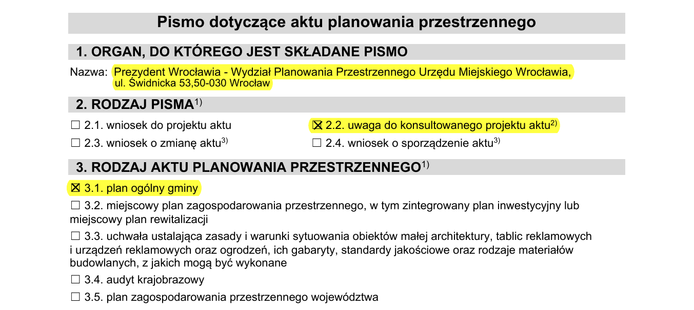
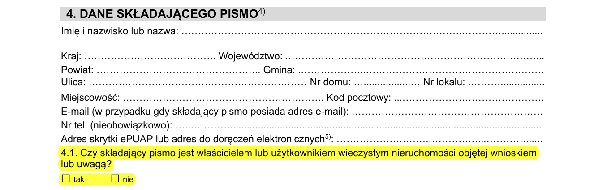
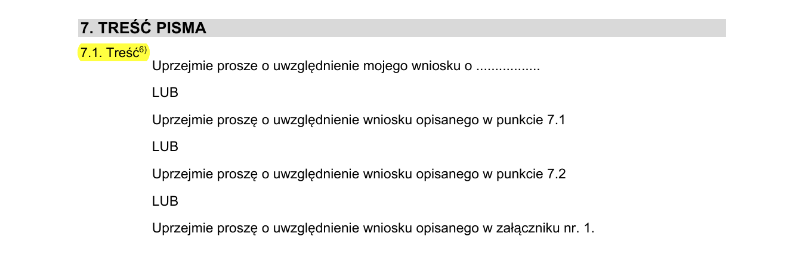
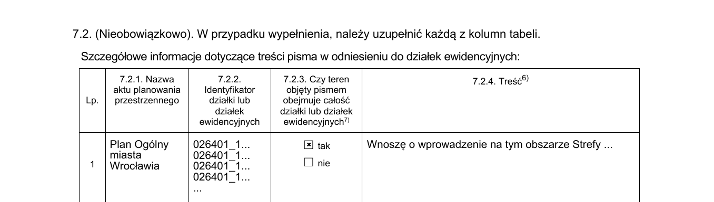
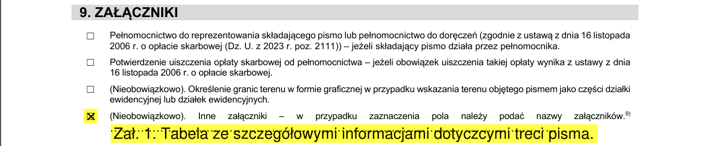
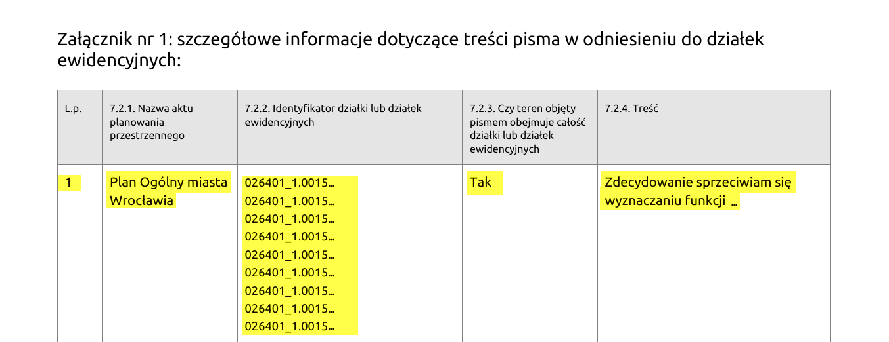

# Jak wypełnić wniosek do Planu Ogólnego?

## Krok 1: Pobierz lub uzyskaj formularz wniosku

Dokument który należy wypełnić to *pismo dotyczące aktu planowania ogólnego*.

Dokument możesz pobrać w wersji elektronicznej:

- Z naszej strony:
    -  w [edytowalnym formacie PDF](assets/wzory/wpl_edytowalny_formularz_wniosku_do_aktu_plan_przestrzennego_07_2025.pdf){: target="_blank" }
    -  w [formacie DOCX](assets/wzory/wpl_pismo_dot_aktu_planowania_przestrzennego_07_2025.doc){: download }
- Z [Systemu Informacji Przestrzennej Wrocławia](https://geoportal.wroclaw.pl/planowanie_przestrzenne/dokumenty):

!!! info "Wnioski papierowe"

    Po rozpoczęciu konsultacji społecznych, wniosek papierowy będzie można uzyskać w punktach konsultacyjnych.

!!! success "Generator wniosków"

    Możesz także skorzystać z [generatora wniosków do Planu Ogólnego](https://teraz.wroclaw.pl/){: target="_blank"}, który poprowadzi Cię krok po kroku przez proces składania uwag.

## Krok 2: Wypełnij formularz

Wzór wypełnionego wniosku z uwagami:
{ .border1 }

Punkty do wypełnienia:

1. Organ do którego kierujesz wniosek: *Prezydent Wrocławia - Wydział Planowania Przestrzennego Urzędu Miejskiego Wrocławia, ul. Świdnicka 53,50-030 Wrocław*

2. Rodzaj pisma: *2.2. uwaga do konsultowanego projektu aktu*

3. Rodzaj aktu: *3.1. plan ogólny gminy*

{ .border1 }

W punktach 4, 5, 6 podajemy dane adresowe, dane korespondencyjne oraz dane pełnomocnika (jeśli korzystamy z pełnomocnika).

__Uwaga__: w punkcie 4.1. konieczne jest zaznaczenie czy we wniosku konsultujemy obszar, którego jest się właścicielem lub użytkownikiem wieczystym. Jeśli masz wątpliwości, sprawdź w [Systemie Informacji Przestrzennej Wrocławia](https://geoportal.wroclaw.pl/mapy/wlasnosci/). 

{ .border1 }

W punkcie 7.1.:

- Przesyłamy treść wniosku/swoje uwagi, zapisane jako sugestia ogólna.
- Prosimy o uwzględnienie szczegółowego wniosku w punkcie 7.2. i/lub 7.3 i/lub w załączniku.

!!! info "Sugestia"

    Formularz przewiduje stosunkowo mało miejsca na wypisanie numerów działek i wysłanie swoich uwag. Jeżeli się nie mieścisz, skorzystaj z załącznika.
    Jeśli korzystasz z załącznika, koniecznie zaznacz to w punkcie 9 pisma.

{ .border1 }

W punkcie 7.2.1. jako nazwę aktu planowania przestrzennego wpisujemy: *Plan ogólny gminy Wrocław*.

W punkcie 7.2.2. wpisujemy numery działek, których dotyczy wniosek. Numery działek odnajdziesz w [Systemie Informacji Przestrzennej Wrocławia](https://geoportal.wroclaw.pl/mapy/wlasnosci/). 

{ .border1 }

Jeżeli do wniosku dołączasz załącznik, koniecznie zaznacz to w punkcie 9.

{ .border1 }

Załącznikiem może być kopia punktów 7.2 albo 7.3. Jeśli korzystasz z tej ścieżki, zaznacz to w punkcie 7.1 (*"Proszę o uwzględnienie szczegółowego wniosku zawartego w załączniku"*).

