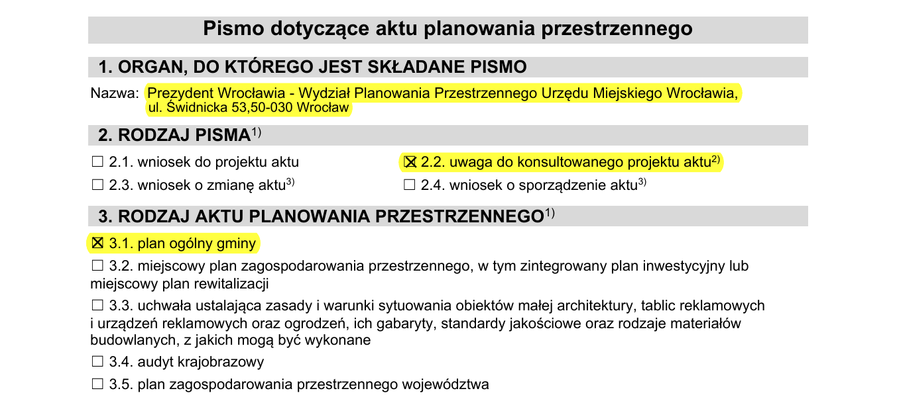
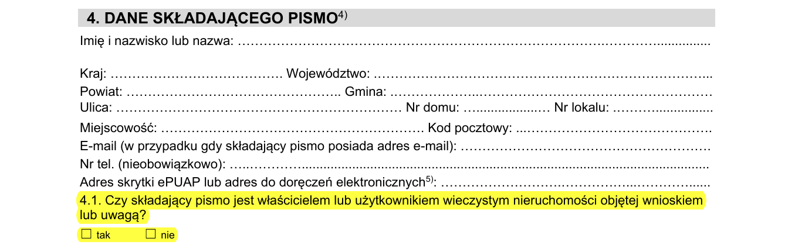
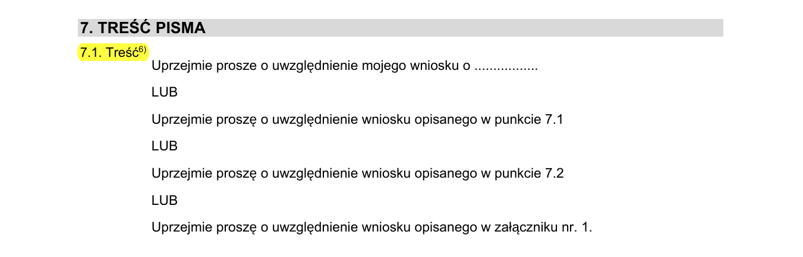
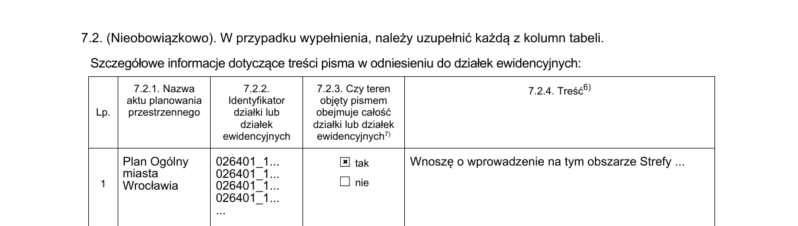
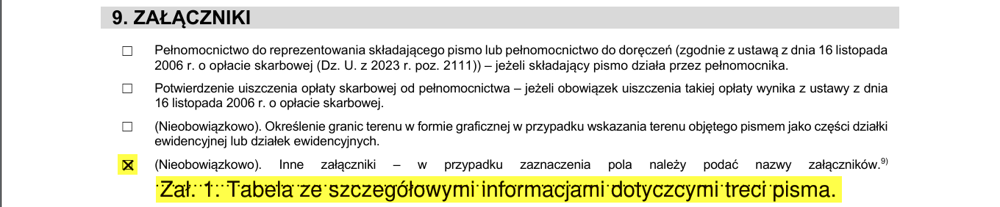
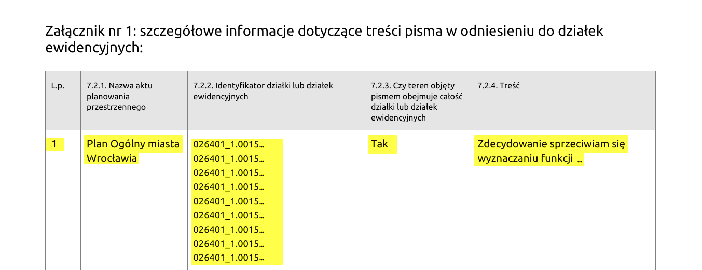

# Jak wypełnić uwagę do Planu Ogólnego?

## Krok 1: Pobierz oficjalny formularz

Dokument, który należy wypełnić, to *pismo dotyczące aktu planowania przestrzennego*.

Aktualna, oficjalna wersja formularza i materiałów pomocniczych znajduje się w BIP:

- [BIP - konsultacje społeczne planu ogólnego](https://bip.um.wroc.pl/artykul/1174/88854/konsultacje-spoleczne)
- [Formularz DOC](https://bip.um.wroc.pl/attachments/download/143860)
- [Formularz PDF](https://bip.um.wroc.pl/attachments/download/143861)
- [Przykład wypełnionego pisma](https://bip.um.wroc.pl/attachments/download/173111)
- [Instrukcja wypełnienia uwagi](https://bip.um.wroc.pl/attachments/download/173190)
- [Instrukcja - identyfikator działki](https://bip.um.wroc.pl/attachments/download/143863)

!!! info "Formularz papierowy"

    W trakcie konsultacji społecznych (14.04.2026-25.05.2026)
    formularz papierowy jest dostępny w Wydziale Planowania Przestrzennego,
    ul. Świdnicka 53, od poniedziałku do piątku w godz. 9:00-15:30.

!!! success "Generator wniosków"

    Dodatkowo możesz skorzystać z [generatora wniosków do Planu Ogólnego](https://teraz.wroclaw.pl/){: target="_blank"}, który pomaga przygotować treść uwagi według predefiniowanych szablonów.

## Krok 2: Wypełnij formularz

Wzór wypełnionego formularza z uwagami:
{ .border1 }

Punkty do wypełnienia:

1. Organ, do którego kierujesz pismo: *Prezydent Wrocławia - Wydział Planowania Przestrzennego Urzędu Miejskiego Wrocławia, ul. Świdnicka 53, 50-030 Wrocław*

2. Rodzaj pisma: *2.2. uwaga do konsultowanego projektu aktu*

3. Rodzaj aktu: *3.1. plan ogólny gminy*

{ .border1 }

W punktach 4, 5, 6 podajemy dane adresowe, dane korespondencyjne oraz dane pełnomocnika (jeśli korzystamy z pełnomocnika).

__Uwaga__: w punkcie 4.1. konieczne jest zaznaczenie, czy uwaga dotyczy obszaru, którego jesteś właścicielem lub użytkownikiem wieczystym. Jeśli masz wątpliwości, sprawdź w [Systemie Informacji Przestrzennej Wrocławia](https://geoportal.wroclaw.pl/mapy/wlasnosci/).

{ .border1 }

W punkcie 7.1.:

- Przesyłamy treść uwagi, zapisaną jako sugestia ogólna.
- Prosimy o uwzględnienie szczegółowej uwagi w punkcie 7.2 i/lub 7.3 i/lub w załączniku.

!!! info "Sugestia"

    Formularz przewiduje stosunkowo mało miejsca na wypisanie numerów działek i wysłanie swoich uwag. Jeżeli się nie mieścisz, skorzystaj z załącznika.
    Jeśli korzystasz z załącznika, koniecznie zaznacz to w punkcie 9 pisma.

{ .border1 }

W punkcie 7.2.1. jako nazwę aktu planowania przestrzennego wpisujemy: *Plan ogólny gminy Wrocław*.

W punkcie 7.2.2. wpisujemy numery działek, których dotyczy uwaga. Numery działek odnajdziesz w [Systemie Informacji Przestrzennej Wrocławia](https://geoportal.wroclaw.pl/mapy/wlasnosci/).

{ .border1 }

Jeżeli do formularza dołączasz załącznik, koniecznie zaznacz to w punkcie 9.

{ .border1 }

Załącznikiem może być kopia punktów 7.2 albo 7.3. Jeśli korzystasz z tej ścieżki, zaznacz to w punkcie 7.1 (*"Proszę o uwzględnienie szczegółowej uwagi zawartej w załączniku"*).

## Krok 3: Złóż uwagę

W trakcie konsultacji społecznych (14.04.2026-25.05.2026) wypełniony formularz możesz:

- wysłać e-mailem na adres [wpl@um.wroc.pl](mailto:wpl@um.wroc.pl)
- wysłać przez ePUAP na adres `/umwroclaw/SkrytkaESP`
- wysłać za pomocą [e-doręczenia](https://edoreczenia.gov.pl/) na adres Urzędu Miejskiego Wrocławia, `AE:PL-95179-82549-VVTFT-27`
- nadać na poczcie lub złożyć w sekretariacie Wydziału Planowania Przestrzennego we Wrocławiu, ul. Świdnicka 53, 50-030 Wrocław

Polecamy skorzystanie z [e-doręczenia](https://edoreczenia.gov.pl/), ponieważ jest darmowe, szybkie i wygodne w użyciu oraz generuje potwierdzenie nadania.

Złożenie uwagi nie wymaga żadnej opłaty, chyba że chcesz skorzystać z pomocy pełnomocnika.

