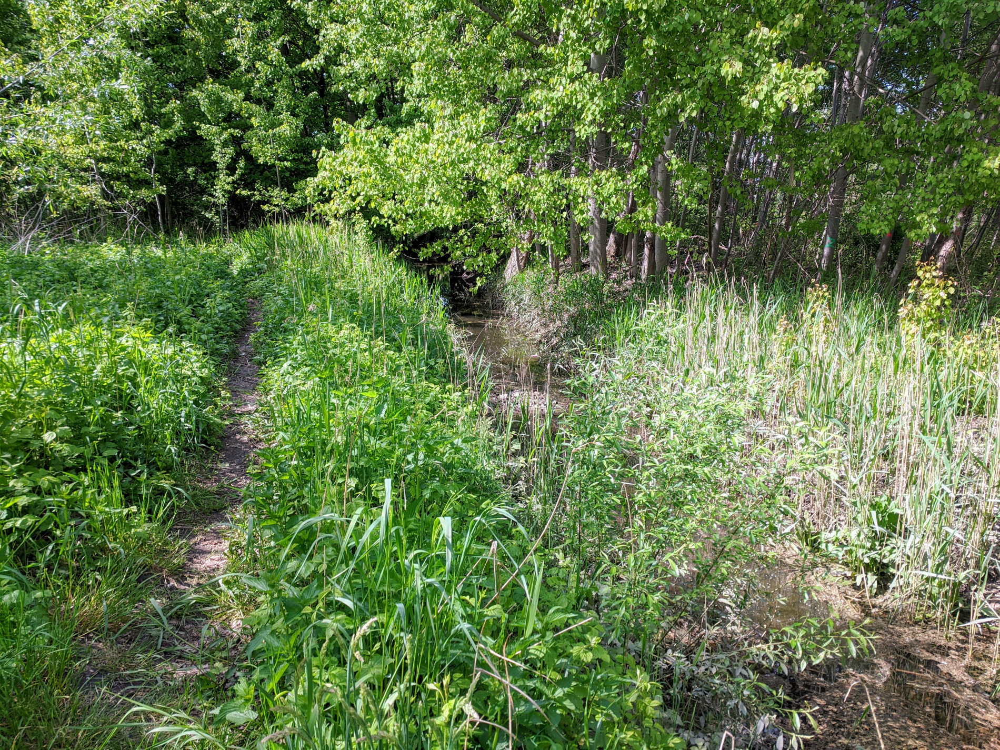
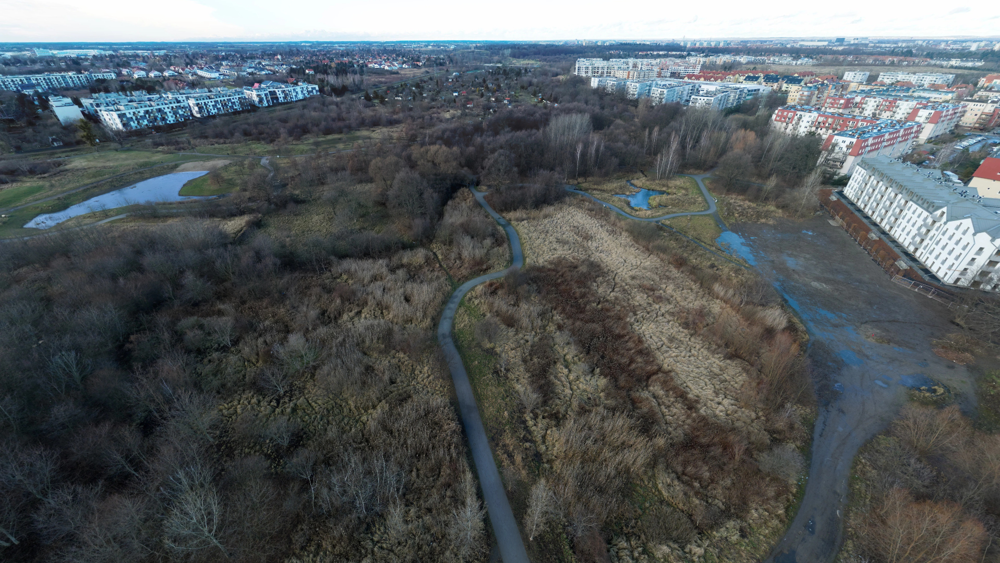
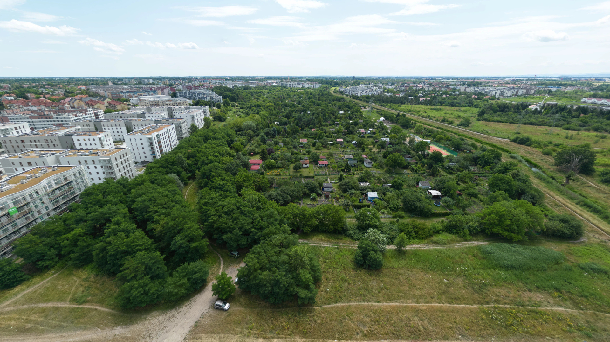

# Zachowanie Parku Krzyckiego i Doliny Olszówki

Park Krzycki i zieleń wzdłuż rzeki Ślęży, pomiędzy ulicą Skarbowców a Racławicką, są zagrożone. Część mieszkańców postuluje budowę łącznika drogowego w tym rejonie, co może naruszyć istniejącą zieleń i funkcje przyrodnicze.

!!! quote "Park Krzycki"
    "Park Krzycki został oddany do użytku mieszkańcom pod koniec marca 2024 roku. Pojawiły się zbiorniki wodne, mostki, ławki i ścieżki spacerowe. Urządzenie zieleni, rozbudowa infrastruktury odwodnieniowej oraz zbiorniki retencyjne w parku na osiedlu Krzyki-Partynice kosztowały łącznie 7 mln zł."

    — [wroclaw.pl](https://www.wroclaw.pl/inwestycje-wroclaw/park-krzycki)


Wskazywany obszar pełni funkcję korytarza ekologicznego oraz naturalnej retencji, a jednocześnie jest ważnym terenem rekreacyjnym dla okolicznych osiedli. Projekt koncentruje się na utrzymaniu ciągłości zieleni i ograniczeniu presji inwestycyjnej w dolinie.

{ .border1 }

*Olszówka Krzycka w rejonie ul. Porannej, widok w kierunku południowym*. Autor: Julo, [Fotopolska.eu](https://fotopolska.eu/1607028,wroclaw-rzeka-sleza-wroclaw-strumien-olszowka-krzycka,zdjecie.html?o=b293721), CC BY-SA 4.0.
{: .image-caption }

## Co jest postulowane

- ochrona ciągłości zieleni wzdłuż Ślęży
- utrzymanie funkcji retencyjnych doliny i ograniczenie ryzyka podtopień
- zachowanie ogólnodostępnego charakteru terenów rekreacyjnych

## Jak wnioskować o zachowanie parku?

Złóż w czesci [7.2. uwagi](../jak-wypelnic.md#krok-2-wypenij-formularz) do niżej wymienionych działek i wnioskuj u zachowanie parku i doliny. Możesz wymienić konkretne [strefy planistyczne](../strefy.md) (np. SO - strefę otwartą, SZ - strefę zieleni i rekreacji), możesz domagać się wskazania wysokiego minimalnego wskaźnika powierzni biologicznie czynnej, lub wskazać ogólnie, że chodzi o ochronę zieleni i funkcji przyrodniczych wzdłuż Ślęży.

!!! info "Szybkie składanie wniosku"

    Gotowy wniosek możesz szybko wygenerować w [generatorze wniosków](https://teraz.wroclaw.pl/). Na liście projektów należy wybrać **Zachowanie Parku Krzyckiego i Doliny Olszówki**.

{ .border1 }

*Park Krzycki i Dolina Olszówki, widok na północ*. Autor: HMarek, [Fotopolska.eu](https://fotopolska.eu/2625192,foto.html), wykorzystane za zgodą autora.
{: .image-caption }

### Działki

```
026401_1.0015.AR_18.2/8
026401_1.0015.AR_18.3/1
026401_1.0015.AR_18.3/2
026401_1.0015.AR_18.4/1
026401_1.0015.AR_18.5/1
026401_1.0015.AR_18.9/16
026401_1.0015.AR_18.9/17
026401_1.0015.AR_18.9/19
026401_1.0015.AR_18.9/21
026401_1.0015.AR_19.1
026401_1.0015.AR_19.10/5
026401_1.0015.AR_19.2
026401_1.0015.AR_19.4
026401_1.0016.AR_1.1/10
026401_1.0016.AR_1.1/3
026401_1.0016.AR_1.1/4
026401_1.0016.AR_1.1/6
026401_1.0016.AR_1.1/9
026401_1.0016.AR_1.14/3
026401_1.0016.AR_1.2/14
026401_1.0016.AR_1.2/15
026401_1.0016.AR_1.2/16
026401_1.0016.AR_1.2/17
026401_1.0016.AR_1.3/3
026401_1.0016.AR_1.3/7
026401_1.0016.AR_1.4/1
026401_1.0016.AR_4.46/1
026401_1.0016.AR_4.47/1
026401_1.0016.AR_4.48/1
026401_1.0016.AR_9.1/1
026401_1.0016.AR_9.2/1
026401_1.0016.AR_9.3/1
026401_1.0016.AR_9.5/2
026401_1.0016.AR_9.6/19
026401_1.0016.AR_9.6/4
026401_1.0016.AR_9.7/1
026401_1.0016.AR_9.7/2
026401_1.0016.AR_9.7/3
```


{ .border1 }

*Park Krzycki i Dolina Olszówki, widok na południe*. Autor: HMarek, [Fotopolska.eu](https://fotopolska.eu/2342683,foto.html), wykorzystane za zgodą autora.
{: .image-caption }


