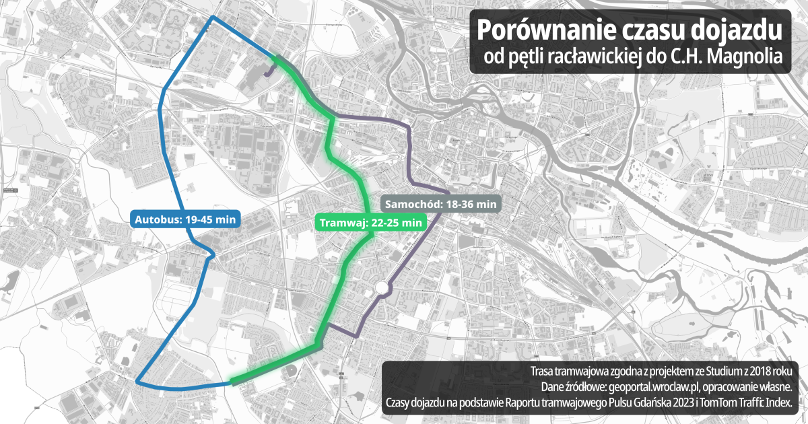

# Tramwaj na Racławickiej

Ul. Racławicka posiada rezerwę pod linię tramwajową, ujętą w Studium 2018 i powtórzoną w aktualnym projekcie planu. Realizacja tramwaju ma zmniejszyć korki i poprawić obsługę komunikacyjną południa Wrocławia.

Projekt dotyczy zabezpieczenia korytarza transportu szynowego w osi ulicy Racławickiej. Zakres obejmuje teren planowanej pętli, torowiska oraz infrastruktury towarzyszącej.

## Założenia projektu

- utrzymanie rezerwy terenu pod linię tramwajową i pętlę
- spójne powiązanie z istniejącą siecią transportu zbiorowego
- poprawa dojazdu z osiedli południowych do centrum miasta

Poniższa wizualizacja przedstawia przykładowy dojazd do ul. Legnickiej z ul. Racławickiej zgodnie z projektem ze Studium 2018 i pokazuje sens zachowania korytarza transportowego.

{ .border1 }

## Działki

```
026401_1.0028.AR_40.17/2
026401_1.0028.AR_40.17/6
026401_1.0028.AR_40.17/8
026401_1.0028.AR_40.19
026401_1.0028.AR_41.4
026401_1.0016.AR_1.2/8
026401_1.0016.AR_1.3/1
026401_1.0016.AR_1.5/1
026401_1.0016.AR_1.6/1
026401_1.0028.AR_42.10
026401_1.0016.AR_1.7/19
026401_1.0028.AR_37.7/2
026401_1.0016.AR_1.7/18
026401_1.0016.AR_2.1/3
026401_1.0028.AR_45.67
026401_1.0011.AR_6.1/3
```
