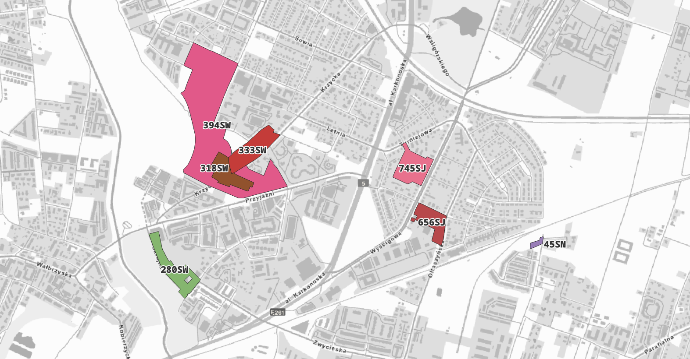

# Zachowanie skali zabudowy na Krzykach i Partynicach

Dla części Osiedla Krzyki-Partynice w projekcie Planu Ogólnego wprowadzono wyższe dopuszczalne parametry zabudowy niż w planach miejscowych. Projekt zakłada utrzymanie dotychczasowych parametrów, aby zachować charakter osiedla i ograniczyć presję na infrastrukturę.

W praktyce dotyczy to takich parametrów jak wysokość zabudowy, intensywność oraz minimalny udział powierzchni biologicznie czynnej. Celem jest zachowanie kameralnej skali zabudowy i ograniczenie wzrostu natężenia ruchu.

## Co jest postulowane

- utrzymanie parametrów z obowiązujących planów miejscowych
- ochrona historycznej tkanki osiedla i jej skali
- ograniczenie nadmiernego zagęszczenia zabudowy

## Strefy planistyczne

{ .border1 }

```
280SW
318SW
333SW
394SW
745SJ
656SJ
45SN
```
