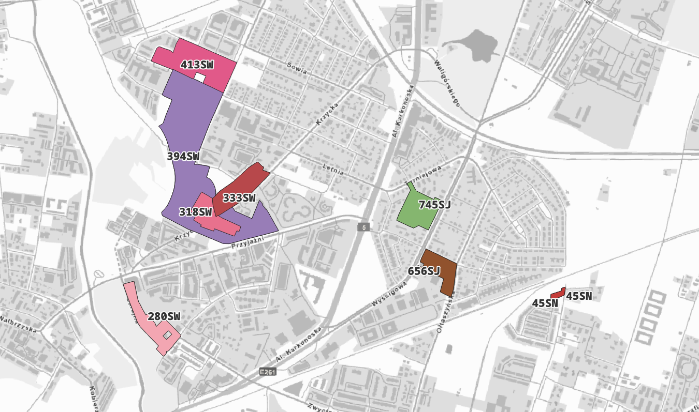

# Zachowanie skali zabudowy na Krzykach i Partynicach

Dla części Osiedla Krzyki-Partynice w projekcie Planu Ogólnego wprowadzono wyższe dopuszczalne parametry zabudowy niż w planach miejscowych. Projekt zakłada utrzymanie dotychczasowych parametrów, aby zachować charakter osiedla i ograniczyć presję na infrastrukturę.

W praktyce dotyczy to takich parametrów jak wysokość zabudowy, intensywność oraz minimalny udział powierzchni biologicznie czynnej. Celem jest zachowanie kameralnej skali zabudowy i ograniczenie wzrostu natężenia ruchu.

Dodatkowo do projektu włączono rejon ul. Skarbowców/Zefirowej/Wietrznej (strefa 413SW). W tym miejscu proponujemy bardziej zachowawcze parametry, tak aby nowa zabudowa odpowiadała temu, co już stoi w okolicy.

## Co jest postulowane

- utrzymanie parametrów z obowiązujących planów miejscowych na większości wskazanych terenów
- dla strefy 413SW (ul. Skarbowców/Zefirowa/Wietrzna): maksymalnie 12 m wysokości i 20% powierzchni zabudowy
- ochrona historycznej tkanki osiedla i jej skali
- ograniczenie nadmiernego zagęszczenia zabudowy

!!! quote "Uchwała Rady Osiedla Krzyki-Partynice"
    "Negatywnie opiniuje się dopuszczenie zabudowy o maksymalnej wysokości 18 m w strefie 413SW i 40% udział powierzchni zabudowy (ul. Skarbowców/Zefirowa/Wietrzna); proponuje się ustalić maksymalną wysokość 12 m i 20% udziału powierzchni zabudowy, zgodnie z obecnym zagospodarowaniem."

## Strefy planistyczne

{ .border1 }

```
280SW
318SW
333SW
394SW
413SW
745SJ
656SJ
45SN
```
