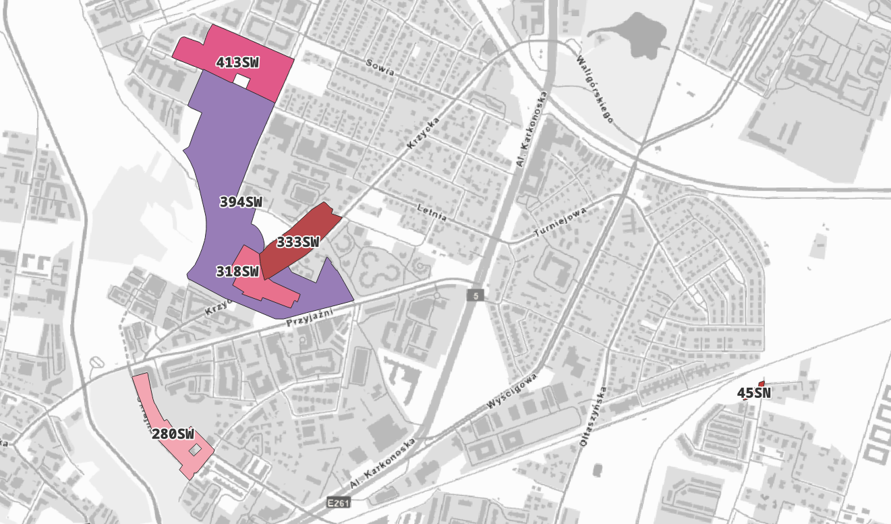

# Zachowanie skali zabudowy na Krzykach i Partynicach

Dla części Osiedla Krzyki-Partynice w projekcie Planu Ogólnego wprowadzono wyższe dopuszczalne parametry zabudowy niż w planach miejscowych. Projekt zakłada utrzymanie dotychczasowych parametrów, aby zachować charakter osiedla i ograniczyć presję na infrastrukturę.

W praktyce dotyczy to takich parametrów jak wysokość zabudowy, intensywność oraz minimalny udział powierzchni biologicznie czynnej. Celem jest zachowanie kameralnej skali zabudowy i ograniczenie wzrostu natężenia ruchu.

## Co aktualnie przewiduje Projekt Planu Ogólnego

### 280SW - ulica Skrajna

Projekt Planu Ogólnego zakłada podniesienie skali zabudowy w tym miejscu do 18m, co jest znaczącym wzrostem w porównaniu do obowiązującego planu miejscowego. Taka zmiana może prowadzić do znacznego zagęszczenia zabudowy i zwiększenia natężenia ruchu w tej części osiedla.

Bez oprotestowania, te niskie budynki mogą zostać zastąpione gęstym osiedlem mieszkaniowym.

<div style="position:relative;width:100%;padding-top:75%;overflow:hidden;">
<iframe src="https://www.google.com/maps/embed?pb=!1m18!1m12!1m3!1d237.44969947985373!2d16.988310652083527!3d51.06188578663129!2m3!1f17.69845517890378!2f44.94148360538776!3f0!3m2!1i1024!2i768!4f35!3m3!1m2!1s0x470fc3c5fa4e40df%3A0xde3c88bd12218454!2sSkrajna%2C%20Wroc%C5%82aw!5e1!3m2!1sen!2spl!4v1777137990359!5m2!1sen!2spl" style="position:absolute;top:0;left:0;width:100%;height:100%;border:0;" allowfullscreen="" loading="lazy" referrerpolicy="no-referrer-when-downgrade"></iframe>
</div>

### 333SW, 318SW - ulica Szarugi, Babiego Lata, Krzycka, Mglista

Według proponowego projektu Planu Ogólnego, domki które znajdują się na tym obszarze bedą mogły zostać wyburzone i zastąpione zabudową wielorodzinną do 18m (Szarugi),  lub 12m (Babiego Lata, Krzycka, Mglista). Taka zmiana może prowadzić do znacznego zagęszczenia zabudowy i zwiększenia natężenia ruchu w tej części osiedla

<div style="position:relative;width:100%;padding-top:75%;overflow:hidden;">
<iframe src="https://www.google.com/maps/embed?pb=!1m18!1m12!1m3!1d1247.882887237447!2d16.994084786369122!3d51.06889818576641!2m3!1f0!2f0!3f0!3m2!1i1024!2i768!4f13.1!3m3!1m2!1s0x470fc3cead26ad3d%3A0xc02c5efcf1958d76!2sSzarugi%2C%2053-020%20Wroc%C5%82aw!5e1!3m2!1sen!2spl!4v1777138413051!5m2!1sen!2spl" width="600" height="450" style="position:absolute;top:0;left:0;width:100%;height:100%;border:0;" allowfullscreen="" loading="lazy" referrerpolicy="no-referrer-when-downgrade"></iframe>
</div>

### 394SW - ulice Poranna, Róży Wiatrów, Skarbowców, Szarugi, Krzycka

Mieszkańcy tych ulic doskonale wiedza, jak gęsto jest zabudowana ta część osiedl. Proponowany projekt planuje dogęszczenie poprzez zwiększenie maksymalnej wysokości zabudowy oraz zwiększenie maksymalnego udziału powierzchni zabudowy. 

Czy w tym miejscu potrzebne są kolejne budynki wielorodzinne? Czy nie lepiej zachować aktualną skalę zabudowy i ograniczyć presję na infrastrukturę?

<div style="position:relative;width:100%;padding-top:75%;overflow:hidden;">
<iframe src="https://www.google.com/maps/embed?pb=!3m2!1sen!2spl!4v1777138650192!5m2!1sen!2spl!6m8!1m7!1s0Ac18PFayOBvoyQBHnmJgQ!2m2!1d51.07268683177713!2d16.9926791413886!3f235.8162113366194!4f-2.049960600316666!5f0.7820865974627469" width="600" height="450" style="position:absolute;top:0;left:0;width:100%;height:100%;border:0;" allowfullscreen="" loading="lazy" referrerpolicy="no-referrer-when-downgrade"></iframe>
</div>

### 413SW - ulice Wieczorna, Południowa, Poranna

Projekt Planu Ogólnego zakłada podniesienie skali zabudowy w tym miejscu do 18m, co jest znaczącym wzrostem w porównaniu do obowiązującego planu miejscowego. Taka zmiana może prowadzić do znacznego zagęszczenia zabudowy i zwiększenia natężenia ruchu w tej części osiedla.

Bez oprotestowania, w tym miejscu mogą powstać budynki wielorodzinne do 5-6 kondygnacji.

<div style="position:relative;width:100%;padding-top:75%;overflow:hidden;">
<iframe src="https://www.google.com/maps/embed?pb=!4v1777136417387!6m8!1m7!1s4XGhs94Vx3K4bjF218p2lg!2m2!1d51.07392007991545!2d16.99356753952905!3f353.35206421653055!4f10.470999090272201!5f0.4000000000000002" style="position:absolute;top:0;left:0;width:100%;height:100%;border:0;" allowfullscreen="" loading="lazy" referrerpolicy="no-referrer-when-downgrade"></iframe>
</div>

## O co wnioskować

Jeśli sprzeciwiasz się podniesieniu skali zabudowy w tych miejscach, możesz wnioskować o:
- utrzymanie parametrów z obowiązujących planów miejscowych na większości wskazanych terenów
- ochronę historycznej tkanki osiedla i jej skali
- ograniczenie nadmiernego zagęszczenia zabudowy

We wniosku wymień nast. strefy planistyczne:
```
280SW - ulica Skrajna
318SW, 333SW - ulica Szarugi, Babiego Lata, Krzycka, Mglista
394SW - ulice Poranna, Róży Wiatrów, Skarbowców, Szarugi, Krzycka
413SW - ulice Wieczorna, Południowa, Poranna
45SN - ulica Agrestowa
```


!!! info "Szybkie składanie wniosku"

    Gotowy wniosek możesz szybko wygenerować w [generatorze wniosków](https://teraz.wroclaw.pl/). Na liście projektów należy wybrać **Zachowanie skali zabudowy na Krzykach i Partynicach**.

{ .border1 }

