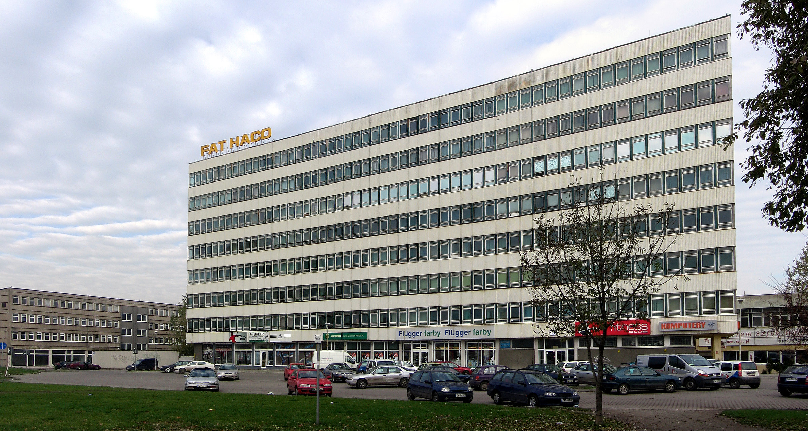
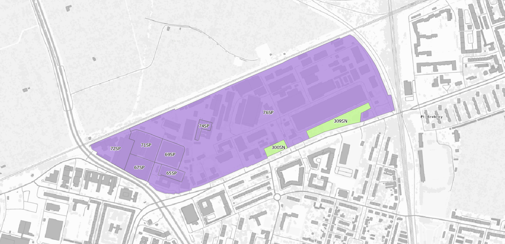
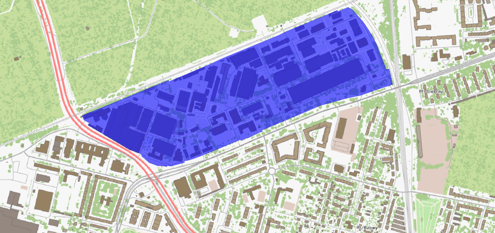

# Spójny plan na FAT

Teren po FAT to ważny obszar, którego przyszłe zagospodarowanie wpłynie na codzienne życie mieszkańców okolicy.  

W 2025 roku procedowano tu inwestycję mieszkaniową w trybie Lex Deweloper. Konsultacje społeczne i głosy mieszkańców pokazały, że proponowana skala zabudowy, rozwiązania komunikacyjne oraz zakres infrastruktury towarzyszącej wymagają innego podejścia.  

Przygotowanie Planu Ogólnego jest właściwym momentem na złożenie uwag, jak oczekujemy aby ta przestrzeń została wykorzystana.

Potrzebny jest jasny kierunek: zagospodarowanie ma być spójne, etapowe i powiązane z realną infrastrukturą, zielenią oraz usługami publicznymi — z korzyścią dla obecnych i przyszłych mieszkańców.

!!! quote "Główny postulat mieszkańców"
    "Planowana inwestycja powinna być elementem kompleksowej koncepcji
    zagospodarowania całego terenu (...) Tylko całościowe rozwiązania w zakresie komunikacji, infrastruktury,
    zieleni, rekreacji i innych funkcji mogą zagwarantować zrównoważony rozwój tego
    obszaru"

    -- raport z konsultacji społecznych FAT (czerwiec 2025)


{ .border1 }

*ul. Grabiszyńska, zabudowania FAT stary biurowiec, widok od południowego wschodu, [Wikimedia Commons](https://commons.wikimedia.org/wiki/Category:FAT-HACO#/media/File:FAT-HACO-SA.jpg), Julo, Public Domain.*
{: .image-caption }

## Co dzisiaj przewiduje Plan Ogólny?

Na dzień dzisiejszy, cały teren jest objęty kilkoma strefami o przeznaczeniu gospodarczym: tereny produkcyjne, komunikacyjne, teren usług.
Dopuszczone jest zabudowanie od 75% do nawet 100% (!) powierzchni działki, a wysokość zabudowy może sięgać nawet 25 metrów (około 8 kondygnacji). 

Przy ul. Grabiszyńskiej wyznaczono dwa niewielkie obszary zieleni.

{ .border1 }

Do tej pory został złożony szereg wniosków postulujących o przeznaczenie tego terenu pod zabudowę mieszkaniową, wielorodzinną, oraz zaledwie dwa wnioski o zabudowę usługową. 

## Co należy postulować w Planie Ogólnym?

- przygotowanie jednej, spójnej koncepcji dla całego obszaru po FAT i HUTMEN
- ograniczenie intensywności i wysokości zabudowy do skali adekwatnej dla otoczenia
- zapewnienie odpowiedniej skali zabudowy i zachowania powierzchni zielonych
- realizacja infrastruktury społecznej i usług publicznych równolegle
  z zabudową mieszkaniową (a nie po fakcie)
- rzetelna analiza ruchu i etapowanie inwestycji komunikacyjnych przed
  dopuszczeniem dużej liczby nowych mieszkań
- ochrona oraz rewitalizacja dziedzictwa poprzemysłowego (hale FAT)
  na funkcje społeczne, kulturalne i usługowe

## Jak wnioskować o ten kierunek w Planie Ogólnym?


Złóż w części [7.1. lub 7.2. uwagi](../jak-wypelnic.md#krok-2-wypenij-formularz)
uwagę dla obszaru po dawnej FAT i HUTMEN (rejon ul. Grabiszyńskiej,
Klecińskiej, Petuniowej i linii kolejowej).

W treści uwagi zawnioskuj o:

- spójne planowanie całego obszaru, zamiast decyzji punktowych
- utrzymanie umiarkowanej skali zabudowy i wysokiego udziału powierzchni
  biologicznie czynnej
- zabezpieczenie terenu pod park publiczny i usługi społeczne
- powiązanie kolejnych etapów zabudowy z gotową infrastrukturą drogową
  i transportem zbiorowym
- zachowanie i adaptację zabytkowych hal do funkcji dostępnych dla mieszkańców

!!! info "Przykładowa treść uwagi"
    Wnoszę o przyjęcie dla terenów po FAT i HUTMEN spójnych zasad
    zagospodarowania opartych na umiarkowanej skali zabudowy, wysokim udziale
    zieleni publicznej oraz obowiązku realizacji infrastruktury społecznej
    i komunikacyjnej równolegle z nową zabudową mieszkaniową. Proszę
    o wykluczenie punktowego, przeskalowanego dogęszczania terenu bez
    zapewnienia adekwatnej obsługi transportowej, edukacyjnej i rekreacyjnej.

!!! info "Szybkie składanie wniosku"

    Gotowy wniosek możesz szybko wygenerować w [generatorze wniosków](https://teraz.wroclaw.pl/). Na liście projektów należy wybrać **Spójny plan na FAT**.

## Numery działek

```
026401_1.0028.AR_21.11/10
026401_1.0028.AR_21.11/11
026401_1.0028.AR_21.11/12
026401_1.0028.AR_21.11/13
026401_1.0028.AR_21.11/14
026401_1.0028.AR_21.11/15
026401_1.0028.AR_21.11/16
026401_1.0028.AR_21.11/17
026401_1.0028.AR_21.11/25
026401_1.0028.AR_21.11/27
026401_1.0028.AR_21.11/28
026401_1.0028.AR_21.11/29
026401_1.0028.AR_21.11/3
026401_1.0028.AR_21.11/30
026401_1.0028.AR_21.11/31
026401_1.0028.AR_21.11/32
026401_1.0028.AR_21.11/34
026401_1.0028.AR_21.11/36
026401_1.0028.AR_21.11/41
026401_1.0028.AR_21.11/42
026401_1.0028.AR_21.11/43
026401_1.0028.AR_21.11/44
026401_1.0028.AR_21.11/46
026401_1.0028.AR_21.11/47
026401_1.0028.AR_21.11/48
026401_1.0028.AR_21.11/5
026401_1.0028.AR_21.11/54
026401_1.0028.AR_21.11/55
026401_1.0028.AR_21.11/57
026401_1.0028.AR_21.11/59
026401_1.0028.AR_21.11/60
026401_1.0028.AR_21.11/61
026401_1.0028.AR_21.11/62
026401_1.0028.AR_21.11/63
026401_1.0028.AR_21.11/64
026401_1.0028.AR_21.11/7
026401_1.0028.AR_21.11/9
026401_1.0028.AR_22.2/10
026401_1.0028.AR_22.2/103
026401_1.0028.AR_22.2/104
026401_1.0028.AR_22.2/105
026401_1.0028.AR_22.2/15
026401_1.0028.AR_22.2/16
026401_1.0028.AR_22.2/18
026401_1.0028.AR_22.2/2
026401_1.0028.AR_22.2/20
026401_1.0028.AR_22.2/23
026401_1.0028.AR_22.2/28
026401_1.0028.AR_22.2/29
026401_1.0028.AR_22.2/3
026401_1.0028.AR_22.2/34
026401_1.0028.AR_22.2/35
026401_1.0028.AR_22.2/37
026401_1.0028.AR_22.2/38
026401_1.0028.AR_22.2/39
026401_1.0028.AR_22.2/4
026401_1.0028.AR_22.2/40
026401_1.0028.AR_22.2/41
026401_1.0028.AR_22.2/43
026401_1.0028.AR_22.2/44
026401_1.0028.AR_22.2/45
026401_1.0028.AR_22.2/47
026401_1.0028.AR_22.2/49
026401_1.0028.AR_22.2/50
026401_1.0028.AR_22.2/51
026401_1.0028.AR_22.2/54
026401_1.0028.AR_22.2/55
026401_1.0028.AR_22.2/56
026401_1.0028.AR_22.2/58
026401_1.0028.AR_22.2/59
026401_1.0028.AR_22.2/6
026401_1.0028.AR_22.2/60
026401_1.0028.AR_22.2/61
026401_1.0028.AR_22.2/62
026401_1.0028.AR_22.2/63
026401_1.0028.AR_22.2/64
026401_1.0028.AR_22.2/66
026401_1.0028.AR_22.2/68
026401_1.0028.AR_22.2/71
026401_1.0028.AR_22.2/72
026401_1.0028.AR_22.2/73
026401_1.0028.AR_22.2/75
026401_1.0028.AR_22.2/76
026401_1.0028.AR_22.2/77
026401_1.0028.AR_22.2/79
026401_1.0028.AR_22.2/8
026401_1.0028.AR_22.2/81
026401_1.0028.AR_22.2/82
026401_1.0028.AR_22.2/83
026401_1.0028.AR_22.2/85
026401_1.0028.AR_22.2/86
026401_1.0028.AR_22.2/87
026401_1.0028.AR_22.2/89
026401_1.0028.AR_22.2/91
026401_1.0028.AR_22.2/92
026401_1.0028.AR_22.2/93
026401_1.0028.AR_22.2/94
026401_1.0028.AR_22.2/95
026401_1.0028.AR_22.2/97
026401_1.0028.AR_22.2/99
026401_1.0028.AR_22.3/2
026401_1.0028.AR_22.3/3
026401_1.0028.AR_22.4
026401_1.0028.AR_22.5/1
026401_1.0028.AR_22.6/2
026401_1.0028.AR_22.6/3
026401_1.0028.AR_22.8
026401_1.0028.AR_24.14/5
```

{ .border1 }

## Zobacz więcej

- [Raport z konsultacji społecznych FAT](https://cdn.prod.website-files.com/67efb67f036832ed52685717/6879f258cd4945db1962e84d_Raport%20z%20konsultacji%20FAT_compressed.pdf) (czerwiec 2025)
