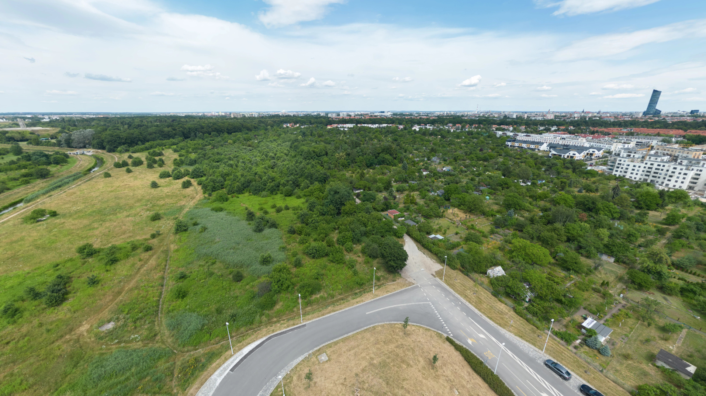
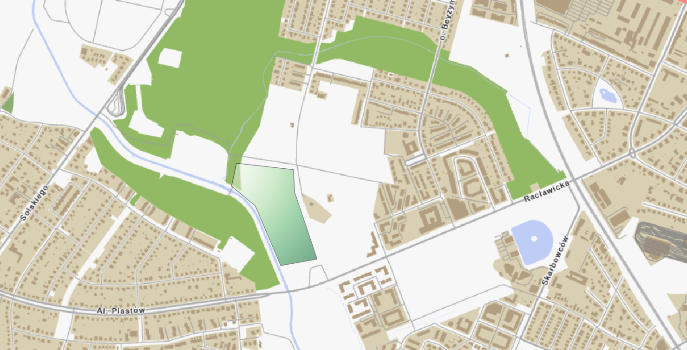
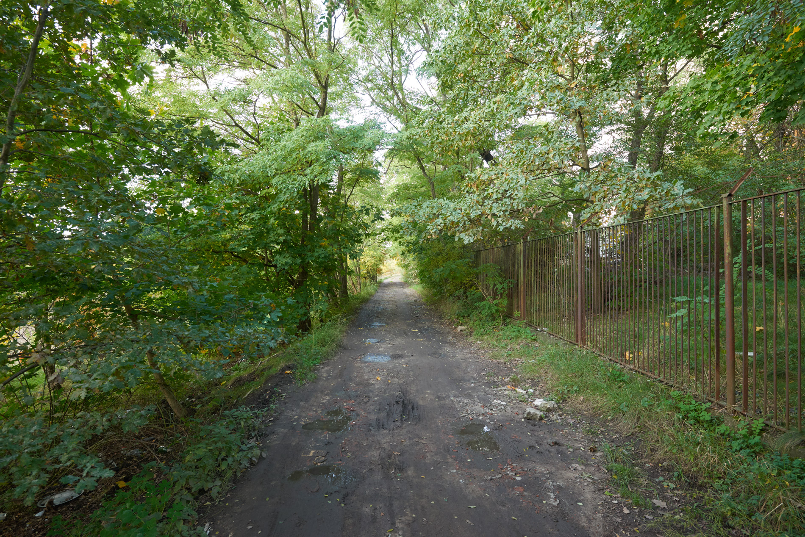

# Zieleń w rejonie parku Grabiszyńskiego

Do Planu Ogólnego Miasta Wrocławia zgłoszono szereg uwag mających na celu zmianę przeznaczenia terenów zielonych przyległych do parku Grabiszyńskiego. Autorzy postulują o zmianę przeznaczenia tych terenów na zabudowę mieszkaniową.

{ .border1 }

*Teren zielony przy pętli Racławicka*. Autor: HMarek, [Fotopolska.eu](https://fotopolska.eu/2342683,foto.html), wykorzystane za zgodą autora.
{: .image-caption }

Zmiana dotyczyłaby terenów na których w chwili obecnej znajdują się Rodzinne Ogrody Działkowe oraz tereny rekreacyjne nad rzeką Ślęzą, przy moście Racławickim.

Postulujemy o składanie kontrpropozycji w celu zachowania obszaru zielonego w tym miejscu oraz wykorzystania terenów rekreacyjnych do powiększenia parku Grabiszyńskiego.

## Jak wnioskować o zachowanie zieleni?

Złóż uwagi w czesci [7.2. formularza konsultacji](../jak-wypelnic.md#krok-2-wypenij-formularz) do niżej wymienionych działek i:

- sprzeciwstaw się przeznaczeniu tych terenów pod zabudowę mieszkaniową,
- wnioskuj o zachowanie obecnego charakteru terenu jako strefy zieleni (SN),

!!! info "Szybkie składanie wniosku"

    Wniosek możesz szybko wygenerować w [generatorze wniosków](https://teraz.wroclaw.pl/). Na liście projektów należy wybrać **Zachowanie zieleni w rejonie parku Grabiszyńskiego**.


## Działki

```
026401_1.0028.AR_40.3/1
026401_1.0028.AR_40.4/1
026401_1.0028.AR_40.5/1
026401_1.0028.AR_40.6/1
026401_1.0028.AR_40.7/1
026401_1.0028.AR_40.8/3
026401_1.0028.AR_40.8/4
026401_1.0028.AR_40.8/5
026401_1.0028.AR_40.8/6
026401_1.0028.AR_40.9
026401_1.0028.AR_40.10/1
026401_1.0028.AR_40.10/2
026401_1.0028.AR_40.11/1
026401_1.0028.AR_40.11/2
026401_1.0028.AR_40.11/3
026401_1.0028.AR_40.12/1
026401_1.0028.AR_40.12/2
026401_1.0028.AR_40.13/2
026401_1.0028.AR_40.13/3
026401_1.0028.AR_40.13/4
026401_1.0028.AR_40.14/2
026401_1.0028.AR_40.14/3
026401_1.0028.AR_40.15/2
026401_1.0028.AR_40.15/3
026401_1.0028.AR_40.16/2
026401_1.0028.AR_40.16/3
026401_1.0028.AR_40.16/4
026401_1.0028.AR_40.16/6
026401_1.0028.AR_40.16/7
026401_1.0028.AR_40.21/1
```

{ .border1 }

{ .border1 }

*Końcowy odcinek ulicy Odkrywców*. Autor: Neo\[EZN\]. [Fotopolska.eu](https://fotopolska.eu/964845,foto.html), CC BY-SA 3.0.
{: .image-caption }
