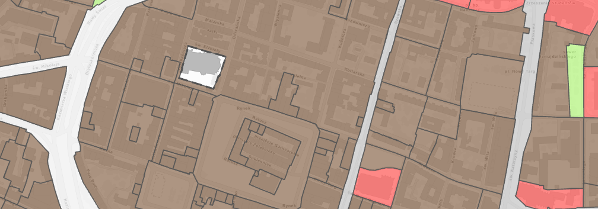

# Strefy planistyczne

Obszar objęty planem dzieli się na strefy planistyczne. 
Każda strefa ma przypisane określone przeznaczenie terenu oraz zasady zagospodarowania i zabudowy.
Podział ten jest elementem obligatoryjnym planu ogólnego gminy.

## Rodzaje stref

<ul class="strefy-grid">
  <li class='SW'><strong>SW</strong> Zabudowa wielorodzinna</li>
  <li class='SJ'><strong>SJ</strong> Zabudowa jednorodzinna</li>
  <li class='SZ'><strong>SZ</strong> Zabudowa zagrodowa</li>
  <li class='SU'><strong>SU</strong> Usługi</li>
  <li class='SH'><strong>SH</strong> Handel wielkopowierzchniowy</li>
  <li class='SP'><strong>SP</strong> Strefa gospodarcza</li>
  <!--<li class='SR'><strong>SR</strong> Produkcja rolnicza</li>-->
  <li class='SI'><strong>SI</strong> Infrastruktura</li>
  <li class='SN'><strong>SN</strong> Zieleń i rekreacja</li>
  <li class='SC'><strong>SC</strong> Cmentarze</li>
  <!--<li class='SG'><strong>SG</strong> Górnictwo</li>-->
  <li class='SO'><strong>SO</strong> Strefa otwarta</li>
  <li class='SK'><strong>SK</strong> Komunikacja</li>
</ul>

Strefy które nie są obecnie wyznaczane we Wrocławiu:

- **SR** - strefa produkcji rolniczej
- **SG** - strefa górnictwa

## Ograniczenia stref

### Strefy mieszkaniowe

Strefy umożliwiające budowę mieszkań (SW, SJ, SZ) mogą być wyznaczane na danym terenie tylko wtedy, gdy zapewniony jest dostęp do infrastruktury społecznej.

Strefy umożliwiające budowę mieszkań (SW, SJ, SZ) mogą być wyznaczane **wyłącznie** na obszarach, które spełniają wymogów dostępności infrastruktury społecznej. Dla Wrocławia, te standardy to:

- **Dostęp do szkoły podstawowej:**
    - nie dalej niż **1500 m** (droga dojścia pieszo).
- **Dostęp do zieleni publicznej:**
    - Obszary o pow. min. 3,0 ha: nie dalej niż **1500 m** od granicy działki.
    - Obszary o pow. min. 20 ha: nie dalej niż **3000 m** od granicy działki.

## Pytania i odpowiedzi

!!! question "W jaki strefach mogą znaleźć się ogródki działkowe?"
    Ogródki działkowe mogą być zlokalizowane w strefach: SW i SJ (strefy wielofunkcyjne z zabudową mieszkaniową) oraz w strefie SN (zieleń i rekreacja).

!!! question "Dlaczego w Planie Ogólnym w znajdują się 'białe plamy' bez przypisanej strefy?"
    Zazwyczaj są to tereny wojskowe, nie podlegające planowaniu przestrzennemu.
    Ciekawym przykładem jest luka na wrocławskim rynku.

    

    Jest to kościół garnizonowy, teren wojskowy, ale dostępny publicznie. Nie podlega pod akt planowania.
